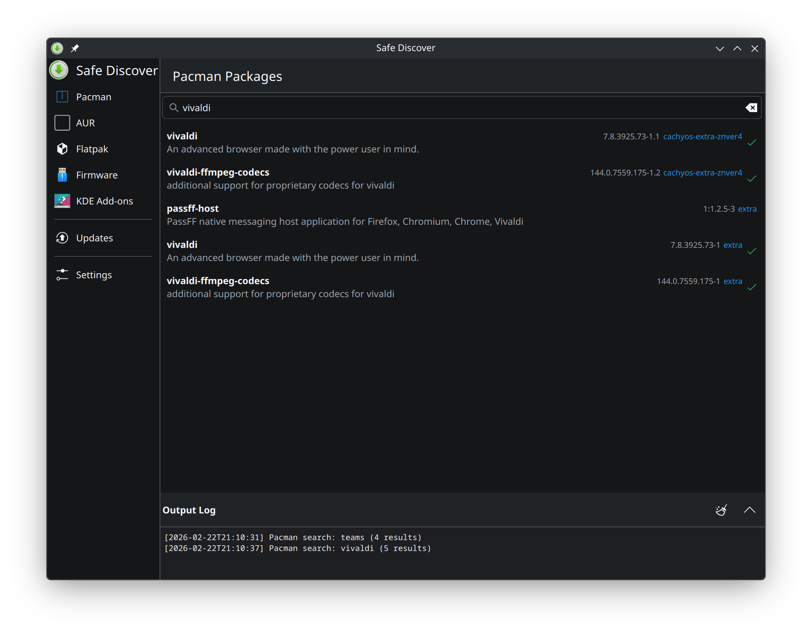
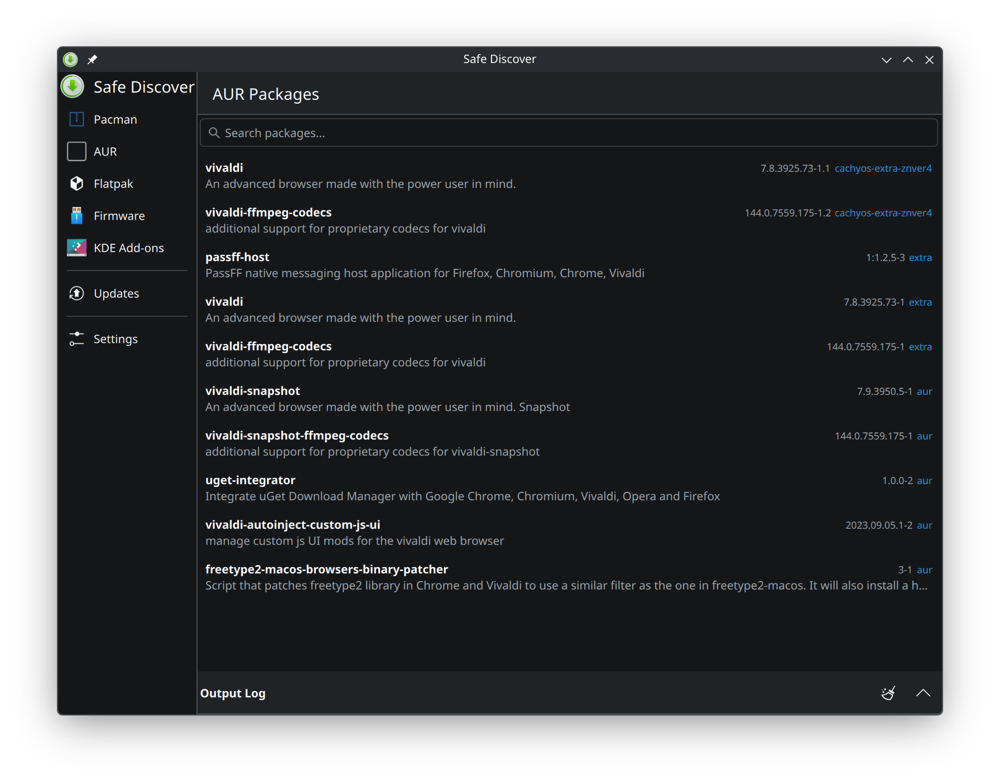
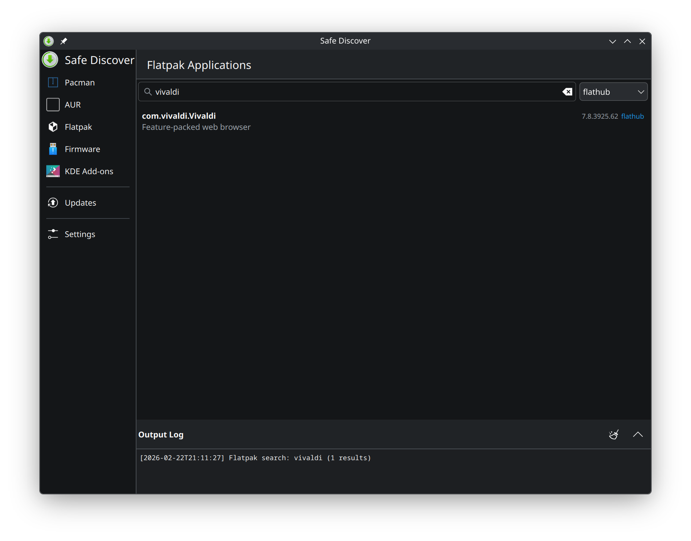
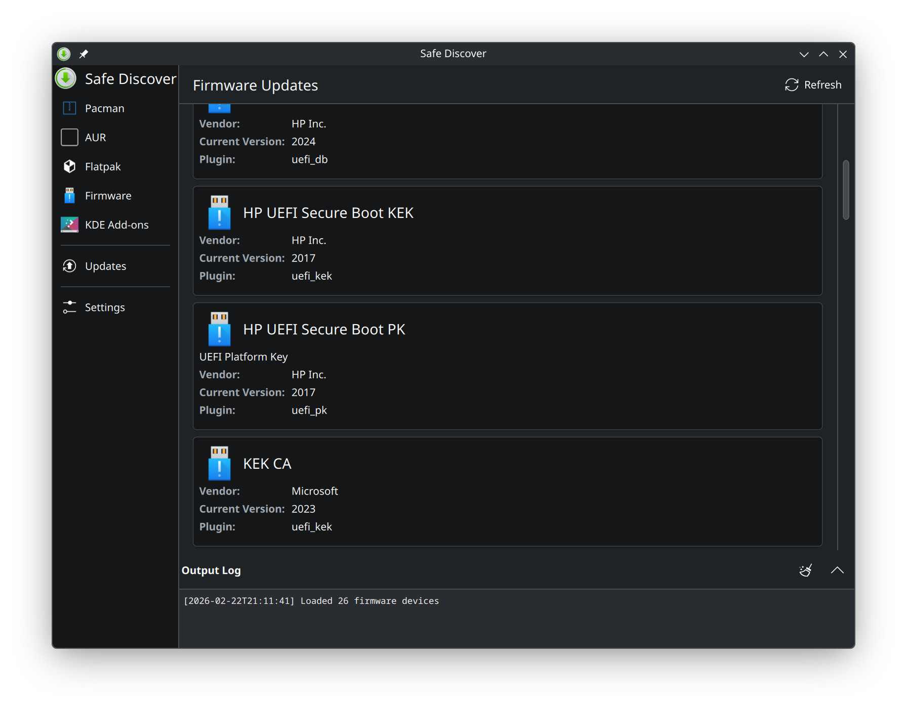
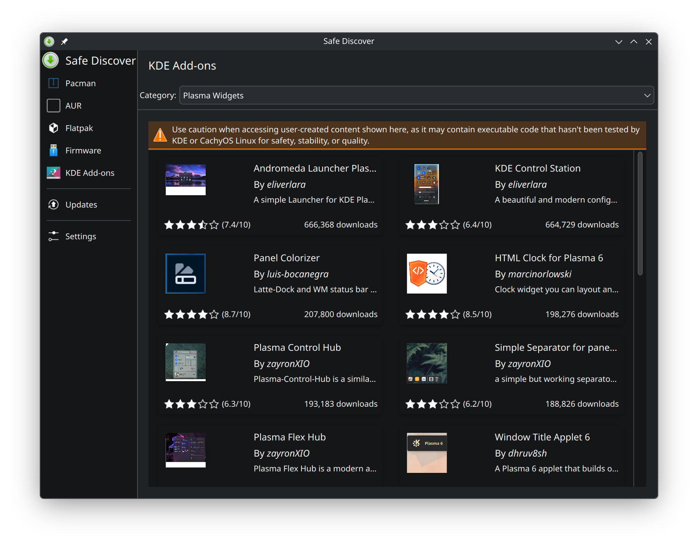
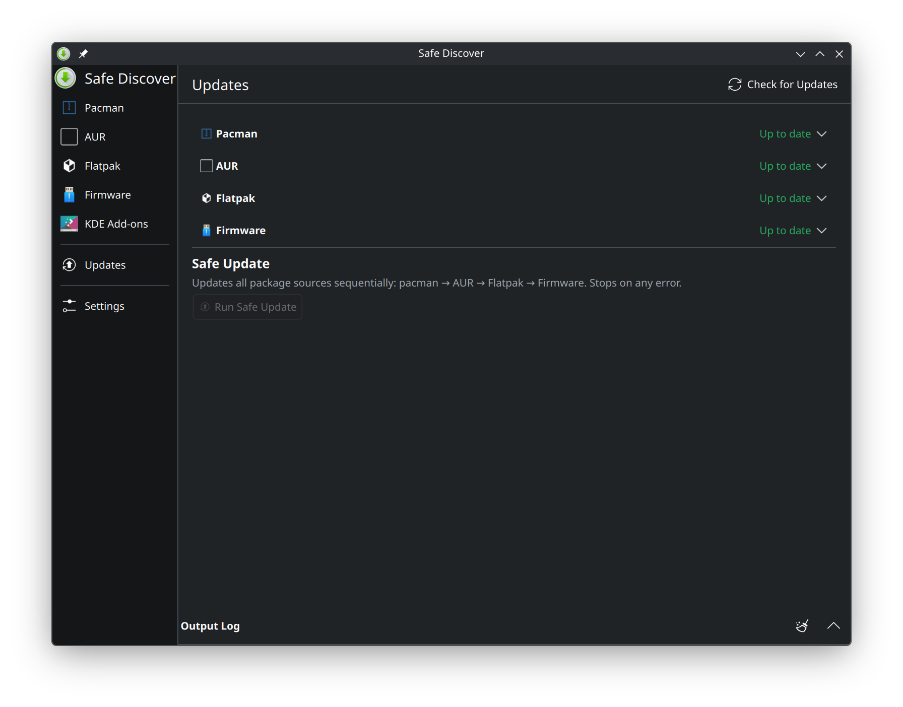
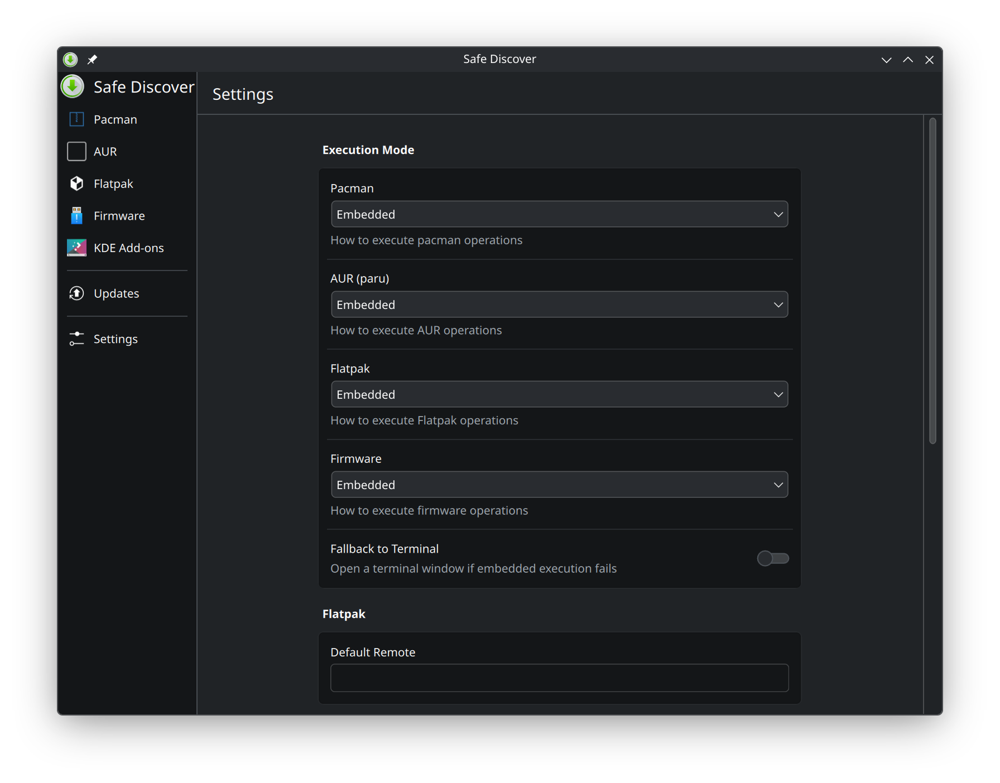

# Safe Discover

A Kirigami-based package management GUI for Arch Linux and CachyOS. Unified interface for Pacman, AUR, Flatpak, firmware updates, and KDE add-ons — no PackageKit required.



## Features

- **Pacman** — Search, install, and remove official repository packages
- **AUR** — Browse and install AUR packages via [paru](https://github.com/Morganamilo/paru), with terminal mode for interactive builds
- **Flatpak** — Manage Flatpak applications across multiple remotes
- **Firmware** — View devices and apply firmware updates via [fwupd](https://fwupd.org/)
- **KDE Add-ons** — Install Plasma widgets, themes, icons, and more from the KDE Store
- **Safe Update** — One-click sequential update across all backends (pacman → AUR → Flatpak → Firmware), stopping on any error
- **Security** — All privileged operations go through a PolicyKit-guarded helper script with a strict command whitelist

## Screenshots

<details>
<summary>AUR Packages</summary>


</details>

<details>
<summary>Flatpak Applications</summary>


</details>

<details>
<summary>Firmware Updates</summary>


</details>

<details>
<summary>KDE Add-ons</summary>


</details>

<details>
<summary>Updates Dashboard</summary>


</details>

<details>
<summary>Settings</summary>


</details>

## Installation

### From AUR

```bash
paru -S safe-discover
```

### From source

```bash
# Build
cmake -B build && cmake --build build -j$(nproc)

# Install system-wide
sudo cmake --install build

# Or build and install as an Arch package
make package-install
```

### Dependencies

**Required**: qt6-base, qt6-declarative, kirigami, kirigami-addons, kcoreaddons, ki18n, kconfig, knewstuff, polkit

**Optional**: paru (AUR support), flatpak, fwupd (firmware), konsole (terminal mode)

## Development

```bash
# Configure + build + test
make build
make test

# Build and run
make run

# Build Arch package
make package

# All targets
make help
```

See [docs/](docs/README.md) for full architecture documentation, backend details, security model, and contributing guidelines.

## How It Works

Safe Discover invokes CLI tools directly rather than going through PackageKit. Each backend wraps a specific tool:

| Backend | Tool | Operations |
|---------|------|------------|
| Pacman | `pacman` | Search, install, remove, system update |
| AUR | `paru` | Search, install (terminal), 3-step removal with orphan cleanup |
| Flatpak | `flatpak` | Search, install, remove, multi-remote support |
| Firmware | `fwupdmgr` | Device listing, per-device updates |
| KDE Add-ons | KNewStuff | Plasma widgets, themes, icons from store.kde.org |

Privileged operations (install, remove, system update) are escalated through PolicyKit with a helper script that only allows whitelisted commands. See [docs/security.md](docs/security.md) for details.

## License

GPL-3.0-or-later

Copyright (C) 2026 Kinn Coelho Juliao <kinncj@protonmail.com>
