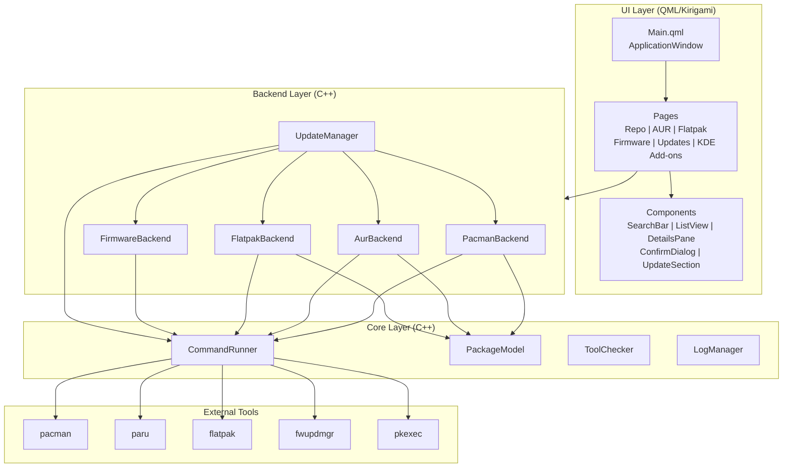
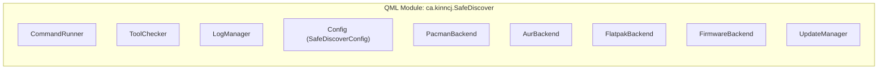
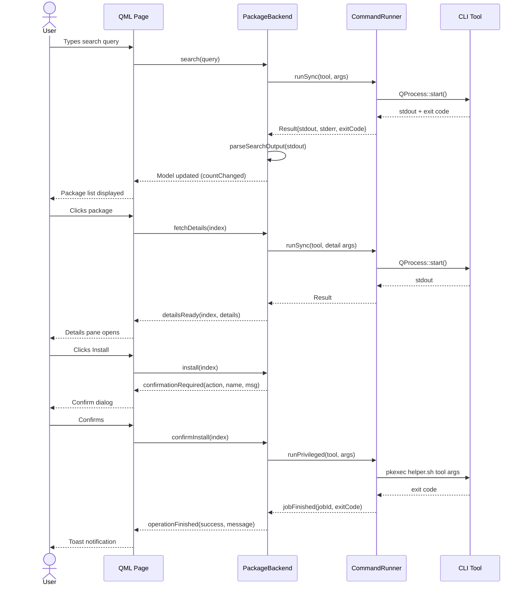
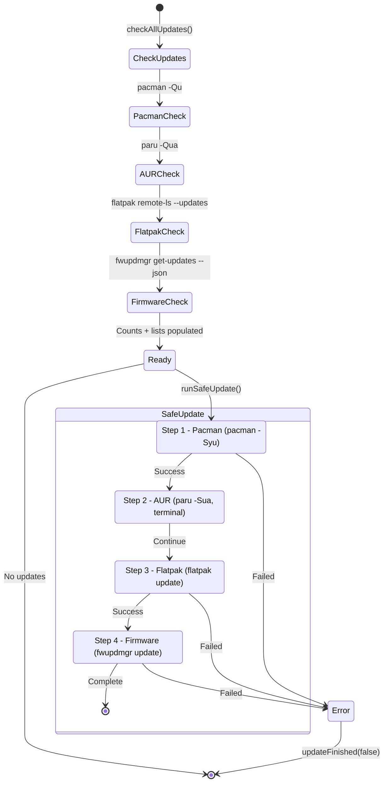

# Architecture

Safe Discover follows a three-layer architecture: **Core**, **Backends**, and **UI (QML)**. All process execution flows through a single `CommandRunner` singleton, and all backends expose data via Qt's model/view system.

## High-Level Overview



## Layer Responsibilities

### Core Layer

| Component | Role |
|-----------|------|
| **CommandRunner** | Singleton process execution engine. Two modes: `Embedded` (background QProcess) and `Terminal` (Konsole). Handles privilege escalation via `pkexec`, pacman lock detection, job tracking, and timeouts. |
| **PackageModel** | Abstract `QAbstractListModel` base class. Defines `PackageInfo` struct and virtual interface (`search`, `fetchDetails`, `install`, `remove`). All package backends inherit from this. |
| **ToolChecker** | Singleton that detects tool availability (`paru`, `flatpak`, `fwupdmgr`, `konsole`) at startup via `QStandardPaths::findExecutable()`. Properties are `CONSTANT`. |
| **LogManager** | Singleton managing in-memory session log and optional file persistence to `~/.local/state/safe-discover/logs/`. |

### Backend Layer

| Backend | Tool | Inherits |
|---------|------|----------|
| **PacmanBackend** | `pacman` | `PackageModel` |
| **AurBackend** | `paru` | `PackageModel` |
| **FlatpakBackend** | `flatpak` | `PackageModel` |
| **FirmwareBackend** | `fwupdmgr` | `QAbstractListModel` (custom) |
| **UpdateManager** | All tools | `QObject` (orchestrator) |

### UI Layer

QML pages loaded on-demand via `Component` + `pageStack.replace()`. Navigation through a `GlobalDrawer` sidebar. Kirigami provides the adaptive layout framework.

## Singleton Registration

All C++ objects are registered as QML singletons in `main.cpp`:



## Data Flow: Search and Install



## Update Orchestration



## Project Structure

```
safe-discover/
├── CMakeLists.txt                        # Root: ECM, Qt6, KF6 setup
├── PKGBUILD                              # Arch Linux packaging
├── ca.kinncj.SafeDiscover.desktop      # Desktop entry
├── ca.kinncj.SafeDiscover.metainfo.xml # AppStream metadata
├── ca.kinncj.safediscover.policy       # PolicyKit policy
├── safe-discover-helper.sh               # Privileged helper (whitelist)
├── src/
│   ├── CMakeLists.txt                    # Target, QML module, link libs
│   ├── main.cpp                          # Entry point, singleton registration
│   ├── core/
│   │   ├── commandrunner.h/.cpp          # Process execution engine
│   │   ├── packagemodel.h/.cpp           # Abstract base model
│   │   ├── toolchecker.h/.cpp            # Tool availability detection
│   │   └── logmanager.h/.cpp             # Session + file logging
│   ├── backends/
│   │   ├── pacmanbackend.h/.cpp          # Pacman backend
│   │   ├── aurbackend.h/.cpp             # AUR backend (paru)
│   │   ├── flatpakbackend.h/.cpp         # Flatpak backend
│   │   ├── firmwarebackend.h/.cpp        # Firmware backend (fwupd)
│   │   └── updatemanager.h/.cpp          # Update orchestrator
│   ├── config/
│   │   ├── safediscoverconfig.kcfg       # KDE config schema
│   │   └── safediscoverconfig.kcfgc      # Config compiler settings
│   └── qml/
│       ├── Main.qml                      # ApplicationWindow + navigation
│       ├── pages/                        # Feature pages
│       ├── components/                   # Reusable UI components
│       └── settings/                     # Settings page
├── tests/
│   ├── CMakeLists.txt
│   ├── tst_commandrunner.cpp
│   ├── tst_pacmanbackend.cpp
│   └── tst_flatpakbackend.cpp
└── docs/                                 # Documentation
```
