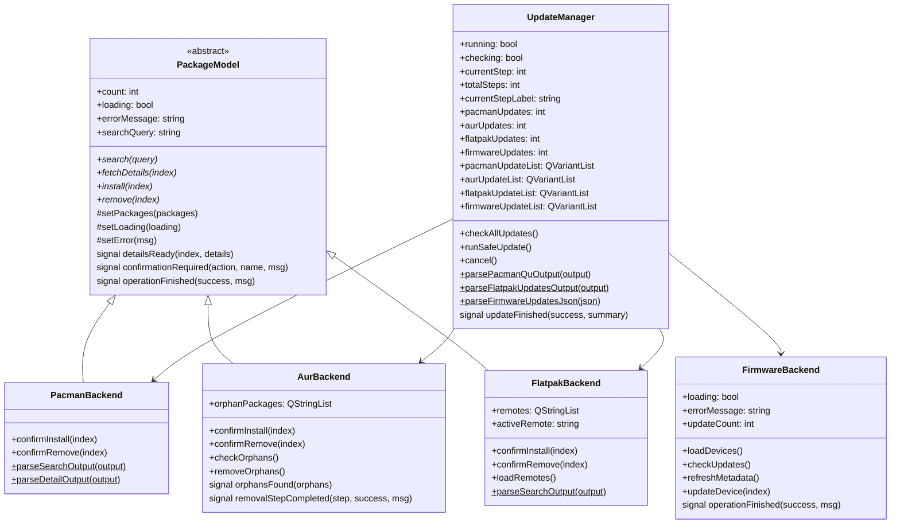
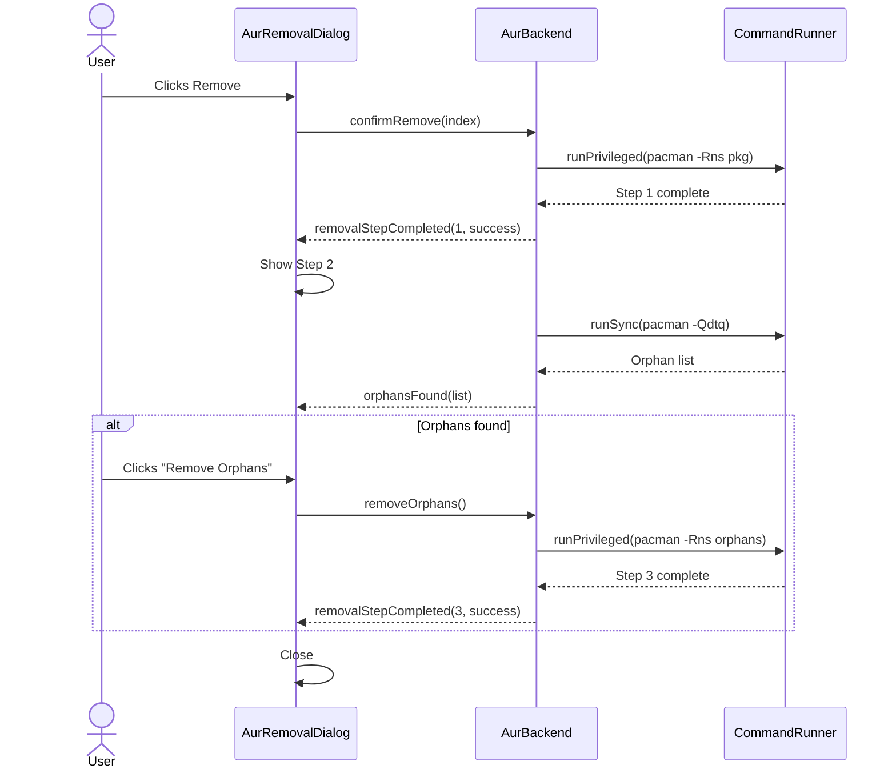

# Backends

Each backend wraps a CLI package management tool and exposes its functionality through Qt's model/view system. All backends use `CommandRunner` for process execution and follow the same signal-driven pattern.

## Backend Overview



## PackageInfo Struct

All `PackageModel` subclasses share this data structure:

| Field | Type | Description |
|-------|------|-------------|
| `name` | `QString` | Package name |
| `version` | `QString` | Available version |
| `description` | `QString` | Package description |
| `repository` | `QString` | Source repository |
| `installed` | `bool` | Whether currently installed |
| `installedVersion` | `QString` | Installed version (if any) |
| `size` | `QString` | Package size |

## PacmanBackend

Wraps `pacman` for official Arch Linux repository packages.

### Commands

| Operation | Command | Mode |
|-----------|---------|------|
| Search | `pacman -Ss <query>` | Sync |
| Details (installed) | `pacman -Qi <name>` | Sync |
| Details (remote) | `pacman -Si <name>` | Sync |
| Install | `pacman -S --needed --noconfirm <name>` | Privileged |
| Remove | `pacman -Rns --noconfirm <name>` | Privileged |

### Output Parsing

**Search output** (`pacman -Ss`):
```
extra/vim 9.1.0-1 [installed]
    Vi Improved, a highly configurable text editor
community/neovim 0.9.5-1
    Fork of Vim aiming to improve user experience
```

Parsed with regex: `^(\S+)/(\S+)\s+(\S+)(.*)$`. The second line is the description. Installation status is detected from the `[installed]` or `[installed: version]` suffix.

**Detail output** (`pacman -Si/-Qi`):
```
Name            : vim
Version         : 9.1.0-1
Description     : Vi Improved
```

Parsed as key-value pairs split on ` : `.

## AurBackend

Wraps `paru` for AUR (Arch User Repository) packages.

### Commands

| Operation | Command | Mode |
|-----------|---------|------|
| Search | `paru -Ss <query>` | Sync |
| Details (installed) | `paru -Qi <name>` | Sync |
| Details (remote) | `paru -Si <name>` | Sync |
| Install | `paru -S --needed <name>` | Terminal |
| Remove | `pacman -Rns --noconfirm <name>` | Privileged |
| Find orphans | `pacman -Qdtq` | Sync |
| Remove orphans | `pacman -Rns --noconfirm <orphans>` | Privileged |

### 3-Step Removal Process

AUR removal includes orphan cleanup:



### Terminal Mode

AUR installations use Terminal mode because `paru` builds packages interactively. The command launches in Konsole and the user interacts with it directly. If Konsole is not available, a warning is displayed.

## FlatpakBackend

Wraps `flatpak` for Flatpak application management.

### Commands

| Operation | Command | Mode |
|-----------|---------|------|
| List remotes | `flatpak remotes --columns=name` | Sync |
| Search | `flatpak search --columns=name,description,application,version,branch,remotes <query>` | Sync |
| Details (installed) | `flatpak info <appid>` | Sync |
| Details (remote) | `flatpak remote-info <remote> <appid>` | Sync |
| Install | `flatpak install -y <remote> <appid>` | Embedded |
| Remove | `flatpak uninstall -y <appid>` | Embedded |

### Output Parsing

**Search output** is tab-delimited:
```
Firefox	Mozilla Firefox	org.mozilla.Firefox	131.0	stable	flathub
```

Fields: Name, Description, Application ID, Version, Branch, Remotes.

### Multi-Remote Support

FlatpakBackend discovers all configured remotes at startup and provides a `activeRemote` property for the UI to select which remote to search against.

## FirmwareBackend

Wraps `fwupdmgr` for firmware updates. Does **not** inherit `PackageModel` — it uses a custom `QAbstractListModel` with device-specific roles.

### Commands

| Operation | Command | Mode |
|-----------|---------|------|
| Load devices | `fwupdmgr get-devices --json` | Sync |
| Check updates | `fwupdmgr get-updates --json` | Sync |
| Refresh metadata | `fwupdmgr refresh` | Privileged |
| Update device | `fwupdmgr update <deviceId>` | Privileged |

### DeviceInfo Struct

| Field | Type | Description |
|-------|------|-------------|
| `name` | `QString` | Device name |
| `deviceId` | `QString` | Unique device identifier |
| `vendor` | `QString` | Device manufacturer |
| `currentVersion` | `QString` | Currently installed firmware version |
| `updateVersion` | `QString` | Available update version |
| `hasUpdate` | `bool` | Whether an update is available |
| `summary` | `QString` | Device description |
| `plugin` | `QString` | fwupd plugin handling this device |

### JSON Parsing

`fwupdmgr` returns JSON with a `Devices` array. Each device has `Name`, `DeviceId`, `Vendor`, `Version`, `Summary`, `Plugin`, and optionally a `Releases` array with available updates. Exit code 2 from `get-updates` means no updates available (not an error).

## UpdateManager

Orchestrates system-wide update checks and sequential safe updates across all four backends.

### Update Check

`checkAllUpdates()` queries each backend's CLI tool and populates both count and list properties:

| Backend | Command | Parse Method | Output Format |
|---------|---------|-------------|---------------|
| Pacman | `pacman -Qu` | `parsePacmanQuOutput()` | `name currentVer -> newVer` |
| AUR | `paru -Qua` | `parsePacmanQuOutput()` | Same as Pacman |
| Flatpak | `flatpak remote-ls --updates --columns=...` | `parseFlatpakUpdatesOutput()` | Tab-delimited |
| Firmware | `fwupdmgr get-updates --json` | `parseFirmwareUpdatesJson()` | JSON |

Each list contains `QVariantMap` entries with `name`, `currentVersion`, and `newVersion` fields. Counts are derived from list sizes.

### Safe Update Sequence

Updates run sequentially in 4 steps. Each step is skipped if its count is 0. The sequence stops on any error (except AUR, which runs in terminal mode and continues immediately).

| Step | Backend | Command | Timeout | Mode |
|------|---------|---------|---------|------|
| 1 | Pacman | `pacman -Syu --noconfirm` | 300s | Privileged |
| 2 | AUR | `paru -Sua --noconfirm` | N/A | Terminal |
| 3 | Flatpak | `flatpak update -y` | 300s | Embedded |
| 4 | Firmware | `fwupdmgr update` | 180s | Privileged |
