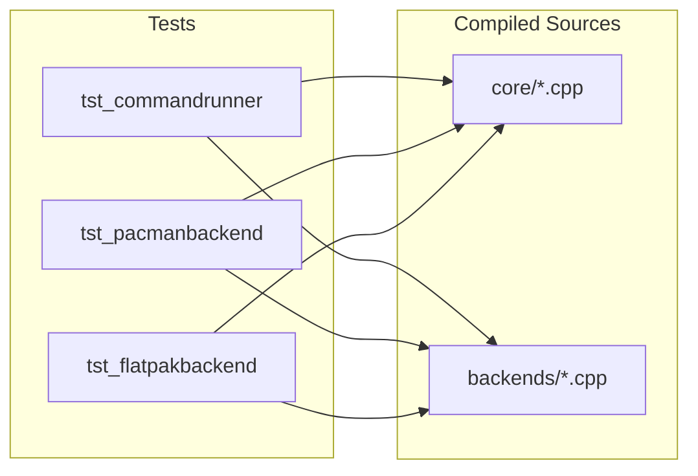
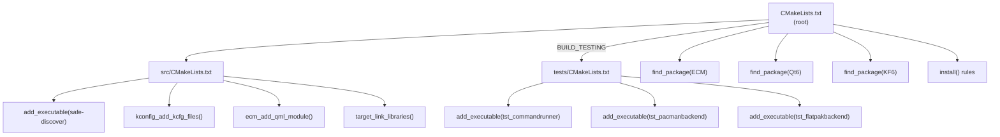

# Build & Development

## Prerequisites

### Build Dependencies

| Package | Minimum Version | Purpose |
|---------|----------------|---------|
| `cmake` | 3.20 | Build system |
| `extra-cmake-modules` (ECM) | 6.0 | KDE CMake modules |
| `qt6-base` | 6.10 | Core Qt framework |
| `qt6-declarative` | 6.10 | QML engine |
| `gcc` or `clang` | C++20 support | Compiler |
| `kirigami` | KF6 | UI framework |
| `kirigami-addons` | 1.0 | Additional UI components |
| `kcoreaddons` | KF6 | Core KDE utilities |
| `ki18n` | KF6 | Internationalization |
| `kconfig` | KF6 | Configuration framework |
| `knewstuff` | KF6 | KDE add-on downloads |

### Runtime Dependencies

| Package | Required | Purpose |
|---------|----------|---------|
| `pacman` | Yes | System package management |
| `polkit` | Yes | Privilege escalation |
| `paru` | No | AUR package management |
| `flatpak` | No | Flatpak application management |
| `fwupd` | No | Firmware updates |
| `konsole` | No | Terminal mode execution |

## Building

```bash
# Configure
cmake -B build

# Build (parallel)
cmake --build build -j$(nproc)

# The binary is at:
./build/bin/safe-discover
```

### Build Options

| Option | Default | Description |
|--------|---------|-------------|
| `BUILD_TESTING` | `OFF` | Build test suite |

```bash
# Build with tests
cmake -B build -DBUILD_TESTING=ON
cmake --build build -j$(nproc)
```

## Testing

Tests use the Qt Test framework.

```bash
# Run all tests
ctest --test-dir build --output-on-failure

# Run a specific test
./build/bin/tst_pacmanbackend
```

### Test Suite

| Test | File | What It Tests |
|------|------|---------------|
| `tst_commandrunner` | `tests/tst_commandrunner.cpp` | Sync/async execution, failure handling, lock detection |
| `tst_pacmanbackend` | `tests/tst_pacmanbackend.cpp` | Search output parsing, detail output parsing, edge cases |
| `tst_flatpakbackend` | `tests/tst_flatpakbackend.cpp` | Tab-delimited search parsing, malformed input handling |
| `appstreamtest` | (auto) | AppStream metadata validation |

### Test Architecture

Tests compile all source files directly (no shared library) and use mocked/controlled inputs for parsing verification:



Static parse methods (e.g., `PacmanBackend::parseSearchOutput()`, `FlatpakBackend::parseSearchOutput()`, `UpdateManager::parsePacmanQuOutput()`) are tested with controlled string inputs without requiring actual CLI tools.

## Installation

```bash
# Install to system (typically /usr/local)
cmake --install build

# Or via PKGBUILD for Arch Linux
makepkg -si
```

### Installed Files

| File | Destination |
|------|-------------|
| `safe-discover` | `${CMAKE_INSTALL_BINDIR}` |
| `ca.kinncj.SafeDiscover.desktop` | `${KDE_INSTALL_APPDIR}` |
| `ca.kinncj.SafeDiscover.metainfo.xml` | `${KDE_INSTALL_METAINFODIR}` |
| `ca.kinncj.safediscover.policy` | `${KDE_INSTALL_DATADIR}/polkit-1/actions` |
| `safe-discover-helper.sh` | `${KDE_INSTALL_LIBEXECDIR}` |

## Packaging (Arch Linux)

The `PKGBUILD` file provides standard Arch Linux packaging:

```bash
# Build the package
makepkg -s

# Install
makepkg -si
```

## CMake Structure



## Troubleshooting

### QML Errors After Rebuild

If you see errors like `Cannot assign to non-existent property` after modifying QML files, the build cache may be stale. Clean and rebuild:

```bash
rm -rf build
cmake -B build && cmake --build build -j$(nproc)
```

### Missing Dependencies

If CMake fails to find packages, ensure the KF6 development packages are installed:

```bash
# CachyOS / Arch Linux
sudo pacman -S extra-cmake-modules qt6-base qt6-declarative \
    kirigami ki18n kconfig kcoreaddons knewstuff kirigami-addons
```

### Pacman Lock

If Safe Discover shows a pacman lock warning, another pacman instance is running. Wait for it to finish, or if the lock is stale:

```bash
sudo rm /var/lib/pacman/db.lck
```
