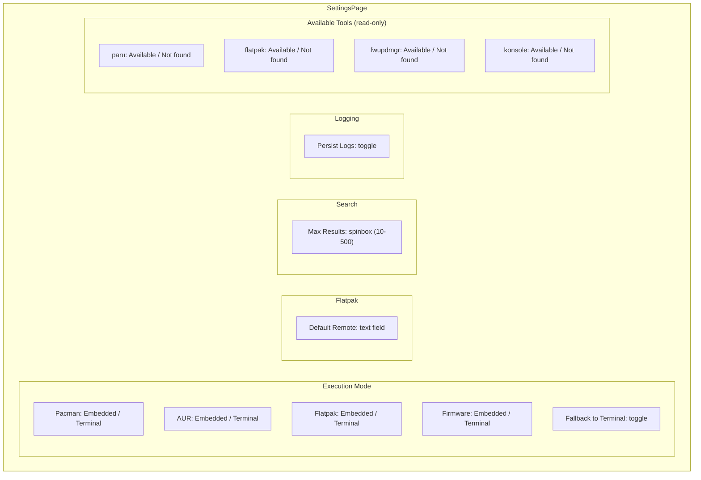

# Configuration

Safe Discover uses KDE's KConfig framework for persistent settings. The configuration schema is defined in `safediscoverconfig.kcfg` and compiled into a `SafeDiscoverConfig` C++ singleton via the `.kcfgc` file.

## Config File Location

```
~/.config/safediscoverrc
```

## Schema

### Execution Group

Controls how each backend runs its commands.

| Key | Type | Default | Description |
|-----|------|---------|-------------|
| `PacmanExecMode` | `int` | `0` (Embedded) | Execution mode for pacman operations |
| `AurExecMode` | `int` | `1` (Terminal) | Execution mode for AUR operations |
| `FlatpakExecMode` | `int` | `0` (Embedded) | Execution mode for Flatpak operations |
| `FirmwareExecMode` | `int` | `0` (Embedded) | Execution mode for firmware operations |
| `FallbackToTerminal` | `bool` | `true` | Fall back to terminal if embedded mode fails |

**Execution Modes**:
- `0` = **Embedded**: Runs in the background via `QProcess`. Output streamed to the log panel.
- `1` = **Terminal**: Launches in Konsole for interactive use. Required for AUR builds.

### Flatpak Group

| Key | Type | Default | Description |
|-----|------|---------|-------------|
| `DefaultRemote` | `string` | `"flathub"` | Default Flatpak remote for searches |

### Search Group

| Key | Type | Default | Range | Description |
|-----|------|---------|-------|-------------|
| `SearchResultLimit` | `int` | `100` | 10-500 | Maximum number of search results |

### Logging Group

| Key | Type | Default | Description |
|-----|------|---------|-------------|
| `PersistLogs` | `bool` | `false` | Write logs to disk |

When enabled, logs are written to:
```
~/.local/state/safe-discover/logs/YYYY-MM-DD.log
```

## QML Access

The config singleton is registered as `Config` in QML:

```qml
import ca.kinncj.SafeDiscover

// Read
let mode = Config.pacmanExecMode

// Write (automatically persisted)
Config.defaultRemote = "flathub"
Config.persistLogs = true
```

## Settings UI

The `SettingsPage.qml` provides a `FormCard`-based interface for all settings:



## KConfig Code Generation

The config system uses two files:

**`safediscoverconfig.kcfg`**: XML schema defining groups, entries, types, and defaults.

**`safediscoverconfig.kcfgc`**: Compiler settings:
```ini
File=safediscoverconfig.kcfg
ClassName=SafeDiscoverConfig
Mutators=true
Singleton=true
```

The `kconfig_add_kcfg_files()` CMake macro generates `safediscoverconfig.h` and `.cpp` from these files at build time.
