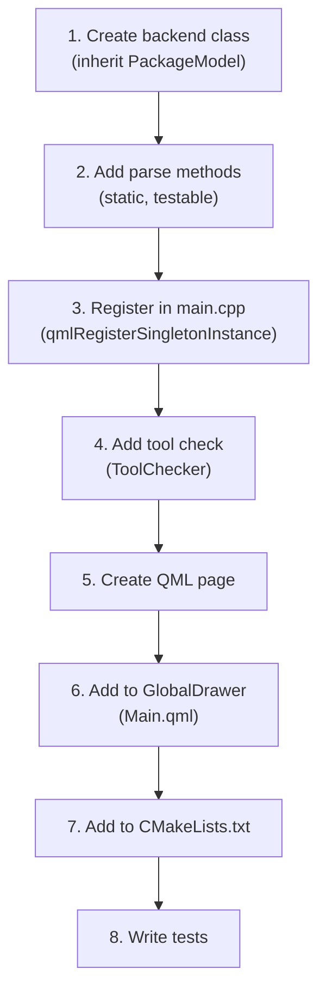

# Contributing

## Development Workflow

1. Fork and clone the repository
2. Create a feature branch
3. Build with tests: `cmake -B build -DBUILD_TESTING=ON && cmake --build build -j$(nproc)`
4. Make your changes
5. Run tests: `ctest --test-dir build --output-on-failure`
6. Submit a pull request

## Code Conventions

### C++

- **Standard**: C++20
- **Naming**: Qt conventions — `camelCase` for methods/variables, `PascalCase` for classes
- **Strings**: Use `QStringLiteral()` for string literals, `QLatin1Char()` for single characters
- **Memory**: Qt parent-child ownership; raw pointers with Qt parent management
- **Signals**: Use `Q_EMIT` macro, connect via `Connections` in QML

### QML

- **Imports**: `import org.kde.kirigami as Kirigami`, `import QtQuick.Controls as QQC2`
- **Components**: One component per file in `src/qml/components/`
- **Pages**: One page per file in `src/qml/pages/`
- **Properties**: Use `required property` for mandatory inputs
- **Signals**: Prefer signal/handler pattern over imperative function calls

### Internationalization

- **Domain**: `safe-discover`
- Use `i18n()` for all user-visible strings
- Use `i18np()` for strings with plural forms
- Never hard-code English strings in QML without i18n wrapping

### Backend Development

When adding a new backend:

1. If it manages packages, inherit from `PackageModel`
2. Use `CommandRunner` for all process execution
3. Expose static parse methods for testability
4. Register as a singleton in `main.cpp`
5. Add a conditional page in `Main.qml` (gate on `ToolChecker`)
6. Add the tool to `ToolChecker`



### Privilege Operations

- All privileged operations **must** go through `safe-discover-helper.sh` via `CommandRunner::runPrivileged()`
- New privileged commands require updating both the helper script whitelist and the PolicyKit policy
- Never run arbitrary user input as root

### Commit Messages

- Use imperative mood: "Add feature" not "Added feature"
- First line: concise summary (under 72 characters)
- Body: explain _why_, not _what_ (the diff shows what)

## Project Structure

### Where to Put Things

| What | Where |
|------|-------|
| New backend class | `src/backends/` |
| Core utility | `src/core/` |
| QML page | `src/qml/pages/` |
| QML component | `src/qml/components/` |
| Config entries | `src/config/safediscoverconfig.kcfg` |
| Tests | `tests/` |
| Documentation | `docs/` |

### File Naming

- C++ headers/sources: `lowercase.h` / `lowercase.cpp`
- QML files: `PascalCase.qml`
- Test files: `tst_classname.cpp`

## Testing Guidelines

- Test all output parsing methods with controlled string inputs
- Use `QTest` framework (not Google Test)
- Static parse methods should be pure functions (no side effects)
- Test edge cases: empty input, malformed data, missing fields

### Adding a New Test

1. Create `tests/tst_newclass.cpp`
2. Add to `tests/CMakeLists.txt`:
   ```cmake
   ecm_add_test(tst_newclass.cpp
       ../src/core/commandrunner.cpp
       # ... other needed sources
       TEST_NAME tst_newclass
       LINK_LIBRARIES Qt6::Test Qt6::Core ...
   )
   ```
3. Run: `ctest --test-dir build --output-on-failure`

## License

This project is licensed under the GNU General Public License v3.0 or later (GPL-3.0-or-later).

Copyright (C) 2026 Kinn Coelho Juliao <kinncj@protonmail.com>

See [LICENSE](../LICENSE) for the full license text.
