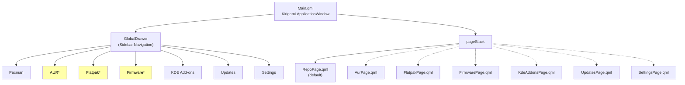

# QML UI

Safe Discover's UI is built with QML using the Kirigami framework, providing a native KDE Plasma look and feel with adaptive layouts.

## QML Module

- **URI**: `ca.kinncj.SafeDiscover`
- **Import**: `import ca.kinncj.SafeDiscover`
- **Registration**: All C++ objects registered as singletons in `main.cpp`

### Exported Singletons

| QML Name | C++ Class | Type |
|----------|-----------|------|
| `CommandRunner` | `CommandRunner` | Core |
| `ToolChecker` | `ToolChecker` | Core |
| `LogManager` | `LogManager` | Core |
| `Config` | `SafeDiscoverConfig` | Config |
| `PacmanBackend` | `PacmanBackend` | Backend |
| `AurBackend` | `AurBackend` | Backend |
| `FlatpakBackend` | `FlatpakBackend` | Backend |
| `FirmwareBackend` | `FirmwareBackend` | Backend |
| `UpdateManager` | `UpdateManager` | Backend |

## Page Hierarchy



*\* Conditional: only shown when the corresponding tool is available (checked via `ToolChecker`)*

Pages are loaded lazily via `Component` and swapped with `pageStack.replace()`.

## Page Structure Pattern

Most package pages follow the same structure:

```mermaid
graph TB
    subgraph Page["Kirigami.ScrollablePage"]
        Header["header: ColumnLayout"]
        Content["content: PackageListView"]
        Footer["footer: OutputLogPanel"]

        Header --> SB["PackageSearchBar"]
        Header --> EM["Error InlineMessage"]

        Content --> Model["model: *Backend"]

        Page --> DDP["PackageDetailsPane<br/>(OverlaySheet)"]
        Page --> CD["ActionConfirmDialog<br/>(PromptDialog)"]
    end
```

### Signal Wiring

Each page wires backend signals to UI components via `Connections`:

```qml
Connections {
    target: PacmanBackend
    function onDetailsReady(index, details) { detailsPane.open(index, details) }
    function onConfirmationRequired(action, name, msg) { confirmDialog.open(...) }
    function onOperationFinished(success, msg) { showPassiveNotification(msg) }
}
```

## Component Library

### PackageSearchBar

A `Kirigami.SearchField` with 2-character minimum validation.

| Signal | Description |
|--------|-------------|
| `searchRequested(query)` | Emitted when user presses Enter with >= 2 characters |

### PackageListView

A `ListView` displaying search results from a `PackageModel`.

| Signal | Description |
|--------|-------------|
| `packageClicked(index)` | Emitted when user clicks a package row |

Delegates display: name (bold), version, repository, description, and a checkmark icon for installed packages. Includes a `BusyIndicator` while loading and placeholder text when empty.

### PackageDetailsPane

A `Kirigami.OverlaySheet` showing detailed package information.

| Property | Type | Description |
|----------|------|-------------|
| `packageName` | `string` | Package name |
| `packageVersion` | `string` | Package version |
| `packageInstalled` | `bool` | Installation status |
| `details` | `var` | QVariantMap of detail key-value pairs |
| `packageIndex` | `int` | Model index |

| Signal | Description |
|--------|-------------|
| `installRequested(index)` | User clicked Install |
| `removeRequested(index)` | User clicked Remove |

### ActionConfirmDialog

A `Kirigami.PromptDialog` for confirming install/remove actions.

| Signal | Description |
|--------|-------------|
| `confirmed(action, index)` | User clicked OK |

### AurRemovalDialog

A multi-step dialog for AUR package removal with orphan cleanup. Shows step indicators (1-2-3) and transitions through:

1. **Remove Package**: Confirmation to remove
2. **Orphan Detection**: Shows list of unused dependencies
3. **Cleanup**: Removes orphans (with busy indicator)

### UpdateSection

A collapsible section showing pending updates for a single backend.

| Property | Type | Description |
|----------|------|-------------|
| `title` | `string` | Section title (required) |
| `iconSource` | `string` | Icon name (required) |
| `updateList` | `var` | `QVariantList` of update entries |
| `showVersionArrow` | `bool` | Show `currentVersion -> newVersion` (default: `true`) |
| `expanded` | `bool` | Whether the list is visible (default: `updateCount > 0`) |

Each entry in `updateList` is a `QVariantMap` with `name`, `currentVersion`, and `newVersion`. The header shows the count badge ("3 updates" or "Up to date") and a chevron toggle.

### OutputLogPanel

A collapsible log viewer that streams output from `LogManager`.

| Property | Type | Description |
|----------|------|-------------|
| `expanded` | `bool` | Whether the panel is expanded |
| `outputText` | `string` | Current log text |

Connects to `LogManager.newLogEntry` to display live output in a monospace `TextArea`.

### FirmwareDeviceCard

A `Kirigami.Card` displaying firmware device information.

| Property | Type | Description |
|----------|------|-------------|
| `deviceName` | `string` | Device name |
| `vendor` | `string` | Manufacturer |
| `currentVersion` | `string` | Installed firmware version |
| `updateVersion` | `string` | Available update version |
| `hasUpdate` | `bool` | Whether an update exists |

| Signal | Description |
|--------|-------------|
| `updateRequested()` | User clicked "Update Firmware" |

### StatusBanner

A thin wrapper around `Kirigami.InlineMessage` for consistent status display.

## Special Pages

### KdeAddonsPage

Uses KNewStuff (`NewStuff.Page`) directly with no custom C++ backend. A category `ComboBox` maps to `.knsrc` files:

| Category | Config File |
|----------|-------------|
| Plasma Widgets | `plasmoids.knsrc` |
| Global Themes | `lookandfeel.knsrc` |
| Plasma Styles | `plasma-themes.knsrc` |
| Color Schemes | `colorschemes.knsrc` |
| Icon Themes | `icons.knsrc` |
| Cursor Themes | `xcursor.knsrc` |
| Window Decorations | `window-decorations.knsrc` |
| KWin Effects | `kwineffect.knsrc` |
| KWin Scripts | `kwinscripts.knsrc` |
| Wallpapers | `wallpaper.knsrc` |
| Splash Screens | `ksplash.knsrc` |

### UpdatesPage

Displays update counts and package lists per backend using `UpdateSection` components. Provides the "Safe Update" button which triggers `UpdateManager.runSafeUpdate()`. Shows a progress bar and step label while running.

### SettingsPage

Uses `FormCard` layout for KConfig-based settings. Groups: Execution mode per backend, Flatpak default remote, search result limit, log persistence, and a read-only tool availability display.

## Internationalization

- **Domain**: `safe-discover`
- **Functions**: `i18n()` for singular strings, `i18np()` for plural forms
- All user-visible strings are wrapped in i18n calls
