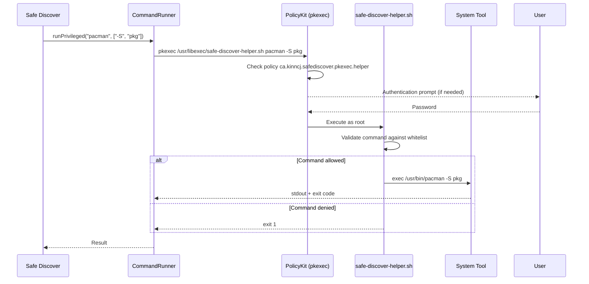

# Security Model

Safe Discover handles privileged operations (installing/removing system packages, updating firmware) through a carefully constrained security model. Root access is never granted directly — all privileged commands pass through PolicyKit and a whitelisting helper script.

## Privilege Escalation Flow



## PolicyKit Policy

The policy file (`ca.kinncj.safediscover.policy`) defines a single action:

| Field | Value |
|-------|-------|
| **Action ID** | `ca.kinncj.safediscover.pkexec.helper` |
| **Description** | Run Safe Discover privileged helper |
| **Message** | Authentication is required to manage system packages |
| **allow_any** | `auth_admin` |
| **allow_inactive** | `auth_admin` |
| **allow_active** | `auth_admin_keep` (session-wide cache) |
| **exec.path** | `/usr/libexec/safe-discover-helper.sh` |
| **exec.allow_gui** | `true` |

The `auth_admin_keep` policy means the user authenticates once per session. Subsequent privileged operations within the same session reuse the cached authorization.

## Helper Script Whitelist

The helper script (`safe-discover-helper.sh`) enforces a strict command whitelist. Only the following operations are permitted:

```mermaid
graph TD
    Entry["safe-discover-helper.sh<br/>receives: COMMAND ARG1 ARG2 ..."]

    Entry --> CheckCmd{Command?}

    CheckCmd -->|pacman| CheckPacArg{First Arg?}
    CheckCmd -->|fwupdmgr| CheckFwArg{First Arg?}
    CheckCmd -->|other| Deny["EXIT 1<br/>Denied"]

    CheckPacArg -->|"-S" / "--sync"| Allow1["exec pacman $@"]
    CheckPacArg -->|"-Syu"| Allow2["exec pacman $@"]
    CheckPacArg -->|"-Rns"| Allow3["exec pacman $@"]
    CheckPacArg -->|other| Deny

    CheckFwArg -->|"refresh"| Allow4["exec fwupdmgr $@"]
    CheckFwArg -->|"update"| Allow5["exec fwupdmgr $@"]
    CheckFwArg -->|"get-devices"| Allow6["exec fwupdmgr $@"]
    CheckFwArg -->|"get-updates"| Allow7["exec fwupdmgr $@"]
    CheckFwArg -->|other| Deny

    style Deny fill:#f66,color:#fff
    style Allow1 fill:#6b6,color:#fff
    style Allow2 fill:#6b6,color:#fff
    style Allow3 fill:#6b6,color:#fff
    style Allow4 fill:#6b6,color:#fff
    style Allow5 fill:#6b6,color:#fff
    style Allow6 fill:#6b6,color:#fff
    style Allow7 fill:#6b6,color:#fff
```

### Allowed Commands

| Tool | Allowed Arguments | Purpose |
|------|-------------------|---------|
| `pacman` | `-S` / `--sync` | Install packages |
| `pacman` | `-Syu` | Full system upgrade |
| `pacman` | `-Rns` | Remove packages with dependencies |
| `fwupdmgr` | `refresh` | Refresh firmware metadata |
| `fwupdmgr` | `update` | Apply firmware updates |
| `fwupdmgr` | `get-devices` | List firmware devices |
| `fwupdmgr` | `get-updates` | Check available firmware updates |

### What Cannot Run as Root

- `paru` / AUR builds (run in user terminal instead)
- `flatpak` operations (run unprivileged)
- Any arbitrary commands
- Any pacman arguments not in the whitelist (e.g., `-U`, `-D`, `-Syy`)
- Any fwupdmgr arguments not in the whitelist (e.g., `install`, `downgrade`)

## Pacman Lock Detection

`CommandRunner` monitors `/var/lib/pacman/db.lck` to detect when pacman's database is locked (another instance is running). The `pacmanLocked` property is exposed to QML, and pages display a warning banner when the lock is active.

## Unprivileged Operations

The following operations run without privilege escalation:

| Operation | Reason |
|-----------|--------|
| `pacman -Ss`, `-Si`, `-Qi`, `-Qu` | Read-only queries |
| `paru -Ss`, `-Si`, `-Qi`, `-Qua` | Read-only queries |
| `paru -S <package>` | Runs in user's terminal (builds as user) |
| `flatpak search`, `info`, `remote-info`, `remotes` | Read-only queries |
| `flatpak install`, `uninstall`, `update` | Flatpak manages its own permissions |
| `pacman -Qdtq` | Read-only orphan query |

## Security Considerations

1. **No shell injection**: All commands are passed as argument arrays to `QProcess`, never constructed as shell strings.
2. **No arbitrary code execution**: The helper script uses `exec` to replace itself with the validated command, preventing any post-execution code from running.
3. **Minimal root surface**: Only `pacman` and `fwupdmgr` operations require root. Flatpak and AUR builds run as the current user.
4. **Timeout enforcement**: All privileged operations have timeouts (180-300 seconds) with graceful termination (SIGTERM, then SIGKILL after 3 seconds).
